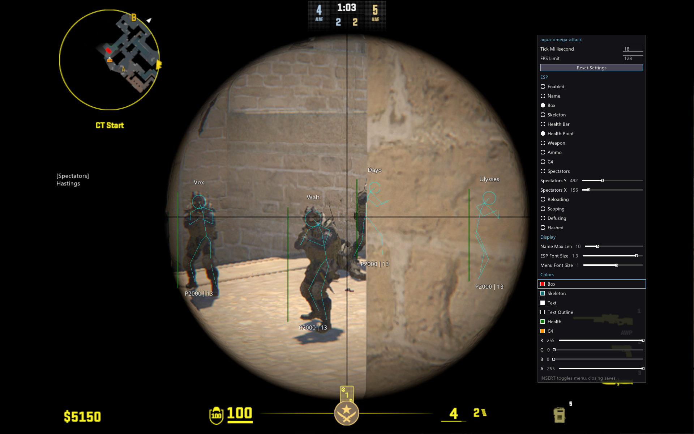

# aqua-omega-attack


a basic read-only counter-strike 2 external ESP with a handle hijacker made with odin language, vulkan, and win32

## screenshot



## features

### esp
- **name**, player names with max length adjustable
- **box**, bounding box
- **skeleton**, bone skeleton
- **health bar**, health bar on the box
- **health point**, hp number
- **weapon**, current weapon
- **ammo**, current weapon ammo
- **c4**, planted bomb & bomb carrier
- **spectators**, see who r spectating you
- **reloading**, shows when player is reloading
- **scoping**, ^ditto but scoped
- **defusing**, ^ditto but defusing
- **flashed**, ^ditto but flashed

### settings
- **color (rgba)**: box, skeleton, text, text outline, health, c4
- **tick (ms)**: how often game memory read
- **fps limit**: esp render fps limit

you can drag menu by holding the title. ur settings will save to file when u close the menu

## building

needs odin compiler: https://github.com/odin-lang/Odin/releases and a vulkan capable gpu

assuming powershell: you can run `./build`. adding `-o` will build optimized, adding `-r` will auto-run. you can combine both.

NOTE: if you ever update the shader files then u will need `glslc` and recompile them. ive precompiled the ones i pushed so u dont have to

## project structure

```
aqua-omega-attack/
├─ main.odin        # main loop
├─ build.ps1        # build script
├─ Config.json      # config file
├─ cfg/             # Config.json stuff
├─ cs2/             # cs2 offsets, enum, math, signatures, blablabla
├─ remote/          # win32 stuff like process/module & mem read/write
├─ renderer/        # vulkan renderer, shaders, whatever.
└─ ui/              # menu & esp overlay drawing
```

## license
MIT
